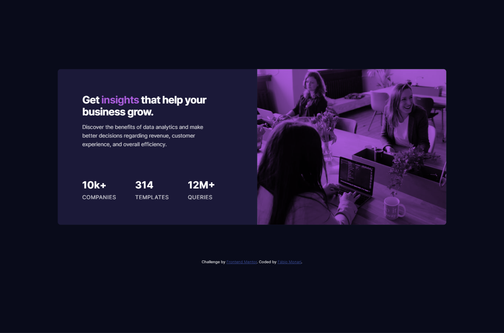

# Stats preview card component solution

This is a solution to the [Stats preview card component challenge on Frontend Mentor](https://www.frontendmentor.io/challenges/stats-preview-card-component-8JqbgoU62).

## The challenge

Users should be able to:

- View the optimal layout depending on their device's screen size

## Screenshots

  
  

## Links

- Solution URL: [Github Pages](https://fabiomonari.github.io/frontend-mentor/challenges/stats-preview-card/)

## Built with

- Semantic HTML5 markup
- CSS Flexbox
- Mobile-first workflow

## Author

- Website - [fabiomonari.com](https://www.fabiomonari.com)
- Frontend Mentor - [@fabiomonari](https://www.frontendmentor.io/profile/fabiomonari)